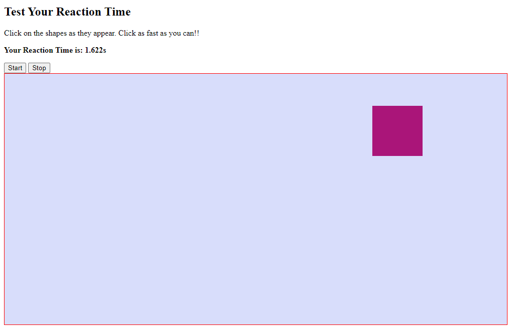

## Reaction Tester Game



## New things here:

1. Making Shapes out of CSS
    - **Square/Rectangle:** Just a div of specified `width` and `height`.
    - **Circle:** Change the `radius` property to `50%`.
    - **Triangle:** 
        1. Change the `width` and `height` to 0px. 
        2. Change the `border` to `red thick solid`, change the other two adjoining borders to `transparent` and same size.
        3. ``` CSS
					   width: 0; 
  					 height: 0; 
  				   border-left: 50px solid transparent;
  					 border-right: 50px solid transparent;
  					 border-bottom: 100px solid red;``` 
 
2. Random Colour Generator Code:
    Randowm method in Math library functionality, check at [this link](https://www.w3schools.com/js/js_random.asp)
    ```JavaScript
    function getRandomColor() {
	  var letters = '0123456789ABCDEF';
	  var color = '#';
	  for (var i = 0; i < 6; i++) {
		  color += letters[Math.floor(Math.random() * 16)];
	  }
	  return color; }
    ```
    
3. Timer object and Methods:
    ```Javascript
    var endTimer = new Date().getTime();
	  var reactionTime = endTimer - timer;
    ```
