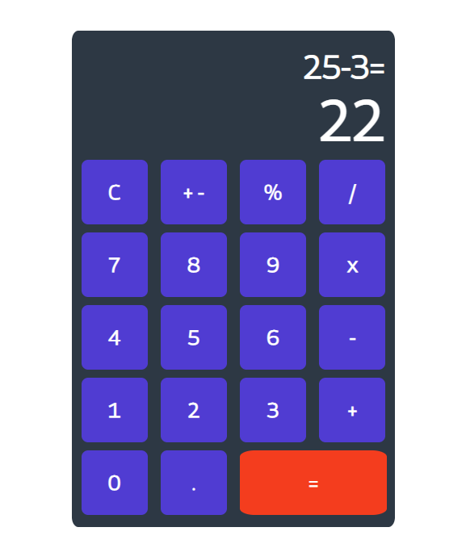

## Simple JS based calculator



## New things here:

1. Use button and input or any tags as per the functionality.
2. While starting a project reset **box-sizing, margins and padding** using:
      ``` CSS
          * {
              box-sizing: border-box;
              margin: 0px;
              padding: 0px; }
      ```
3. Interesting article on aligning [link](https://www.freecodecamp.org/news/css-vertical-align-how-to-center-a-div-text-or-an-image-example-code/amp/)
4. **Difference between querySelector(), querySelectorAll(), getElementById(), getElementsByClass()** : [Entire Article](https://unicorntears.dev/posts/queryselectorall-vs-getelementsbyclassname/#:~:text=querySelectorAll()%20retrieves%20a%20list,live%20HTML%20collection%20of%20elements.)
      - `querySelectorAll()` retrieves a list of elements from the document based on your given selector, and returns a static NodeList object.
      - `getElementsByClassName()` retrieves a list of elements from the document based on an element’s class name, and returns a live HTML collection of elements.
      - THe static NodeList dosen't change even if the HTML elements change after the `querySelectorAll()` is activated.

5. Use of 'of' keyword in for loop - `for (items of NodeArray) {}`
6. Adding Event Listeners, .EventListeners('click', function() {}). `function(){}` is replaced as `()=>` `E.g (e)=> reads like (e) is function of`  
7. **e** or **event** is an object containing information about the action that just happened. The event would have info such as the coordinates of the click (event.screenX for example), the element on which you clicked (event.target), and much more.
8.  The way to bind the handler to the element is by doing `element.addEventListener(eventName, handler)`.
9.  W3Schools Articles: [Event and Event Objects](http://www-db.deis.unibo.it/courses/TW/DOCS/w3schools/jsref/dom_obj_event.asp.html)
